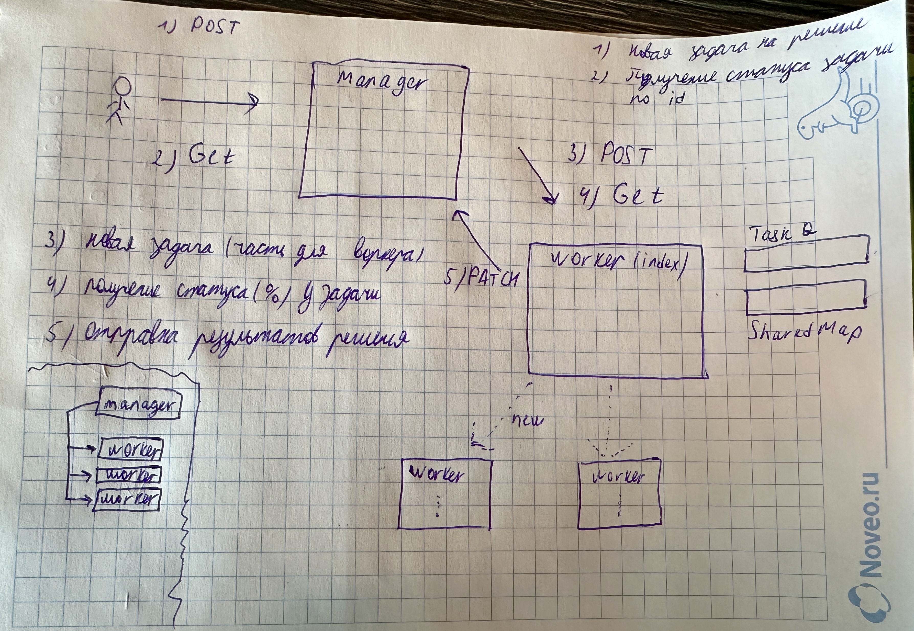

# Hash Cracking Worker System

Этот проект представляет собой систему для параллельного поиска строк, которые соответствуют заданному MD5 хэшу. Процесс разбивается на несколько воркеров, каждый из которых обрабатывает часть возможных строк, и результаты отправляются менеджеру.

## Структура проекта


Проект состоит из нескольких сервисов:

- **manager**: Сервис, который управляет распределением задач и сбором результатов.
- **worker**: Рабочие сервисы, которые выполняют фактическую работу по вычислению строк и хэшированию.

### Технологии:
- **Node.js** - основной язык для разработки.
- **Express.js** - веб-фреймворк для создания API.
- **Worker Threads** - для выполнения вычислений в отдельных потоках.
- **Axios** - для отправки HTTP-запросов.
- **MD5** - для хэширования строк.
- **SharedMap** - для сохранения процента выполнения задачи из разных потоков (https://www.npmjs.com/package/sharedmap).

## Установка

Для того, чтобы запустить проект, нужно:

1. Клонировать репозиторий:
```
git clone https://github.com/nipoks/ris1.git
cd ./ris1
```
2. Установить зависимости для всех сервисов:

```
cd ./manager
npm install
cd ..
cd ./worker
npm install
```
3. Запустить проект из корневой папки с помощью Docker Compose:

```
docker-compose up --build
```

# Пример использования
Сайт для генерации хэша по слову: https://www.md5hashgenerator.com/
### 1. Отправка запроса начала:
```
curl -X POST http://localhost:3000/api/hash/crack -H "Content-Type: application/json" -d '{"hash":"3cbdc7e3769a8b04d992a8f93f58c7b9", "maxLength": 5}'
```
Параметры запроса (JSON):

* hash (строка) - искомый MD5 хэш.
* maxLength (целое число) - максимальная длина строки.

Ответ: d13es (~16 сек)

### 2. Получение статуса задачи
```
curl -X GET http://localhost:3000/api/hash/status?requestId=
```
requestId - id который вернул менеджер после создания задачи
* PART_ANSWER_IS_READY - случилась ошибка у воркера, но кто-то нашел вариант ответа
* IN_PROGRESS - кто-то еще работает
* READY - все воркеры отработали успешно
* ERROR
  
Пример ответа:
```
{  "status" : "IN_PROGRESS",
   "data" : {
              "answer" : null,
              "progress" : "22%"
             }
}
```